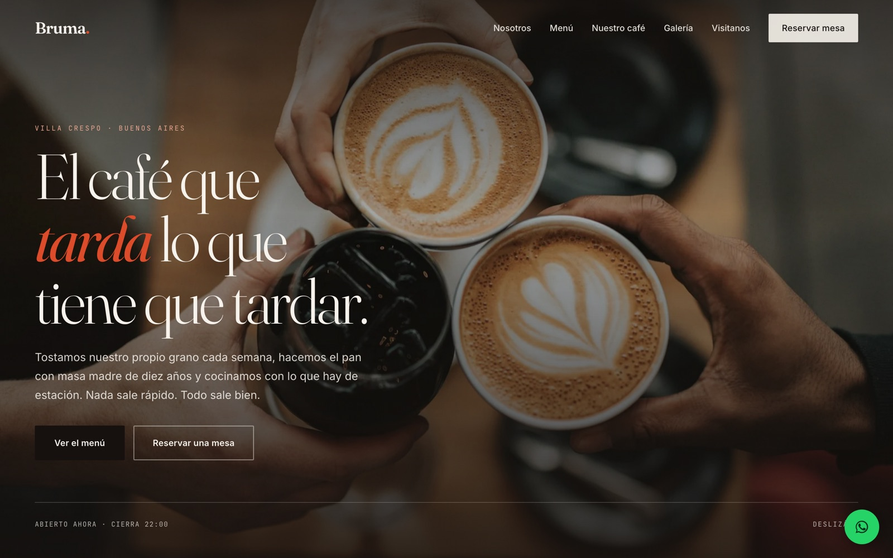

# Bruma — Café de especialidad

Bruma no existe: es una cafetería inventada que usé como pretexto para
construir un sitio institucional completo desde cero, sin frameworks ni
plantillas. No hubo cliente ni encargo — el objetivo era ejercitar un
proyecto entero de punta a punta.

Estático, sin dependencias ni build.

**Demo:** https://cafe-theta-one.vercel.app

   



<sub>La portada, con el estado de apertura calculado contra la hora real del visitante.</sub>


## Qué incluye

- Hero con estado de apertura calculado contra la hora real del visitante
- Menú de 5 categorías y 33 platos, con etiquetas de dieta
- 7 orígenes de café con notas de cata, proceso y altura
- Galería con lightbox navegable por teclado
- Horarios que resaltan el día actual
- Mapa embebido (OpenStreetMap, sin API key ni tarjeta)
- Formulario de reserva con validación propia
- Responsive, accesible y con soporte de `prefers-reduced-motion`

## Editar el contenido

Todo el contenido está en `datos.js`: precios, platos, orígenes y horarios.
No hace falta tocar HTML ni JavaScript para actualizar la carta.

## Correr en local

```bash
python3 -m http.server 8899
```

## Estructura

```
index.html    marcado
style.css     sistema de diseño y layout
datos.js      contenido editable
script.js     comportamiento
```

Pesa 64 KB en total. No usa frameworks.

---

Diseño y desarrollo: [Santiago Hermosilla](https://santiagohermosilla.com)
